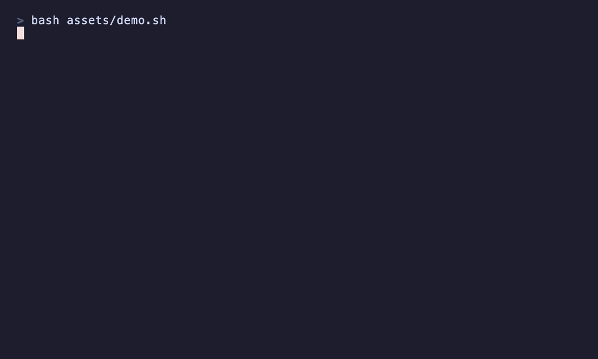

# debrief

A Claude Code skill that turns the end of a work session into actual learning — by making *you* reconstruct what happened before it hands you anything, so the AI's fluency stops standing in for your own understanding.



> *Illustrative example of the skill's output. Re-render with `vhs assets/demo.tape`.*

## The problem it fixes

Working with a capable AI feels productive, and it is — for output. The code runs, the bug is fixed, the decision is made. But the work flows past so smoothly that it all *feels* understood, and you end the session no more able to do the thing yourself than when you started. That feeling of "yeah, I get it" is the symptom, not the evidence.

This is the **fluency illusion** (psychologists call the general version the *illusion of explanatory depth*): watching something done fluently reads, to your brain, as your own competence. It collapses the moment you have to reproduce it cold — usually next week, when the AI's context is gone and you're stuck.

`debrief` is the antidote: a short, structured ritual at the end of a session that makes you retrieve and reconstruct the one or two ideas worth keeping, catches the gaps while they're cheap to fix, and distills a durable, transferable lesson.

## Before / after

**Without `debrief`** (the natural end-of-session recap):

> Here's what we did today: we tracked down the race condition in the counter, added a mutex around the increment, fixed the flaky test, and refactored the handler to a strategy pattern. Everything's passing now. Let me know if you want a summary for the PR.

You read it, you nod, you close the laptop. Nothing was retrieved. Next week you hit a similar race and reach for the AI again.

**With `debrief`:**

> Before we wrap — one thing here is worth actually keeping. Forget what we typed for a second: two threads were hitting that counter at the same time. Walk me through what *actually* goes wrong, step by step.
>
> *(you attempt it, get the first half, hand-wave the second)*
>
> The first half's right. The second half is exactly where it got fuzzy — that's the fluency illusion; it looked obvious thirty seconds ago. Here's the piece you skipped… now: where else in a codebase would you smell this same bug *before* it bites?

You did the work. The lesson is yours.

## What it is

A **conversational ritual**, not a document generator. You trigger it at the end of a session and it runs a five-step loop:

1. **Scope** — pick the one to three ideas actually worth keeping (or honestly call it: nothing here).
2. **Bracket the recap** — name what got done in two sentences, then set it aside. The summary is not the product.
3. **Recall** — you reconstruct each idea in your own words, one question at a time. The answer is withheld. *This is the skill.*
4. **Expose the gap, then close it** — your reconstruction is checked against what's true; gaps are named (that's the illusion, caught), then corrected — never before you've tried.
5. **Make it stick** — distill the transferable principle and, optionally, save a durable lesson note for spaced revisit.

The design is deliberate: the satisfying part of a debrief is the tidy write-up, so the skill **hides** the note-writing behind the recall. You can't get the reward until you've done the retrieval — which is the whole point.

## Why a skill and not just a prompt

You could end every session with "quiz me on what we did." That works for one message. The skill adds what you'd otherwise have to re-prompt for every time:

1. **The recall discipline** — an enumerated set of rules (`references/recall-discipline.md`) that stop the debrief from collapsing back into a lecture: ask before you tell, one question at a time, never accept "makes sense," quiz the *why* and the *transfer* not the trivia, correct only after a retrieval attempt. Without it, the AI's helpfulness quietly defeats the exercise within two turns.
2. **The premature-completion guard** — the structure withholds the write-up until recall is done, so neither you nor the AI can shortcut to a passive summary.
3. **The bow-out rule** — it stays out of mechanical sessions, mid-task flow, and plain status recaps, so it keeps its credibility.
4. **The durable artifact** — when a lesson is worth keeping, it's saved as an atomic, cued note (Obsidian or local markdown) built for spaced revisit, not a log that rots.

## Install

Ships as a Claude Code plugin. From inside Claude Code:

```
/plugin marketplace add tstanmay13/debrief
/plugin install debrief@tstanmay13-debrief
```

Or, for a manual install, clone into `~/.claude/skills/`:

```bash
git clone https://github.com/tstanmay13/debrief.git ~/.claude/skills/debrief-repo
ln -s ~/.claude/skills/debrief-repo/skills/debrief ~/.claude/skills/debrief
```

## How to use it

At the end of a session, say any of:

- `/debrief`
- "what did we learn?" / "what have we learned this session?"
- "did I actually learn this, or did I just watch you do it?"
- "teach me what we just did"
- "let's debrief before I close this"

It can also offer itself after a substantial build, debugging, or decision session. It will **not** fire mid-task, on a purely mechanical session, or when you've asked for a status summary or handoff notes — those are different jobs, and a debrief that fires everywhere gets muted.

### Where lessons get saved

If a lesson is worth keeping, the skill writes it as an atomic, question-led note:

- **Obsidian** — if you keep a vault, that's the default home (uses the `obsidian` CLI; links into your graph; daily notes give you spaced revisit for free).
- **Local markdown** — a `learnings/` folder in the project, or `~/learnings/` for cross-project lessons.
- **In-conversation** — if you don't want a file, it just shows you the note.

## When NOT to use it

- **Mid-task** — you're executing and want the work finished; teaching mid-flow is a tax.
- **Mechanical sessions** — renamed files, ran a formatter, looked up a one-off fact. Nothing transfers; a forced "lesson" is noise.
- **You want a recap, not learning** — status summaries, handoff notes, PR descriptions, changelogs are legitimate and different. Don't let a quiz hijack them.

## Examples

See [EXAMPLES.md](EXAMPLES.md) for full before/after debriefs: a debugging session, a session where the AI made an architectural decision for you, the skill catching a fluency illusion in real time, saving a lesson note to Obsidian, and two counter-examples (a mechanical session and a mid-task moment) where the skill correctly stays out of the way.

## Conceptual roots

The discipline isn't new. The skill borrows from places this instinct already lives:

- **After-action review** — the US Army's structured debrief: reconstruct what was supposed to happen, what did, and why, *before* anyone hands you the lesson.
- **Testing effect** — Roediger & Karpicke: being tested on material beats re-studying it for durable memory. The debrief is a test, not a review.
- **Generation effect** — Slamecka & Graf: you remember what you generate yourself far better than what you're told. Your clumsy reconstruction beats my clean explanation.
- **Illusion of explanatory depth** — Rozenblit & Keil: people are sure they understand things until asked to explain them. Working with AI is this on tap.
- **Desirable difficulties** — Robert Bjork: learning that feels harder in the moment sticks better. The friction is the feature.
- **The Feynman technique** — explain it simply, in your own words; the gaps reveal what you don't actually understand.
- **Zettelkasten** — atomic, linked, cued notes as a learning system, not just storage. The lesson-note format borrows from it.

`debrief` is none of these specifically. It's the one move they share, aimed at the specific way AI makes learning quietly disappear.

## Related skills

- [`product-view`](https://github.com/tstanmay13/product-view) — its sibling: where `product-view` flips Claude out of code-language into the user's perspective, `debrief` flips a finished session out of "output" into "what *you* now understand."
- `grill-me` / grilling skills — relentless one-at-a-time interviewing of a *plan*. `debrief` uses the same one-question-at-a-time instinct, but aimed backward at what already happened, for learning rather than stress-testing.

## Contributing

Two contribution types are the most useful, because they're the failure modes the skill exists to handle:

1. **Recall got skipped.** The skill handed you a passive recap instead of making you reconstruct. File via the [recall-skipped template](.github/ISSUE_TEMPLATE/recall-skipped.md).
2. **Activation misfire.** It fired mid-task or on a mechanical session, or didn't fire when you asked to learn. File via the [activation template](.github/ISSUE_TEMPLATE/activation.md).

Details in [CONTRIBUTING.md](CONTRIBUTING.md).

## License

[MIT](LICENSE).
